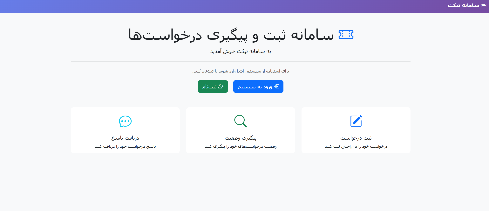
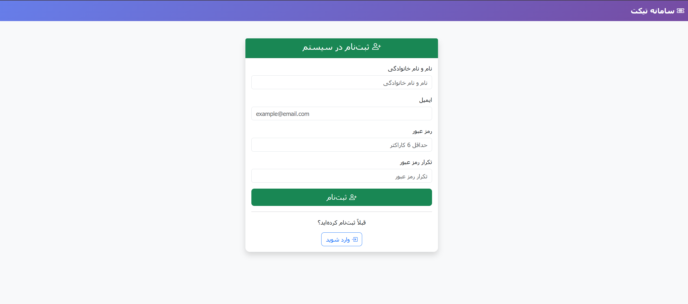
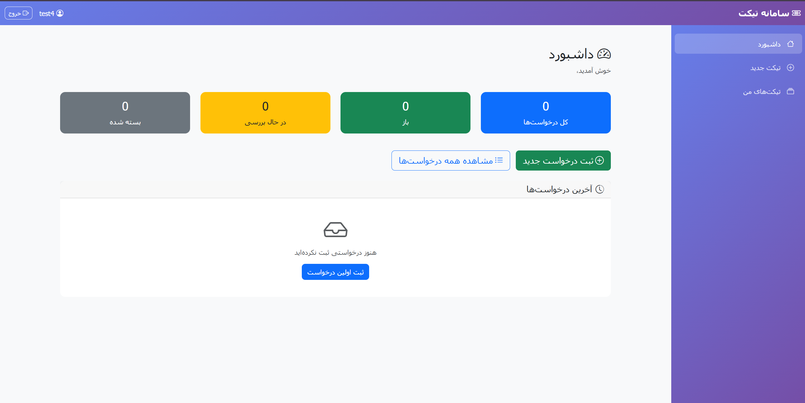
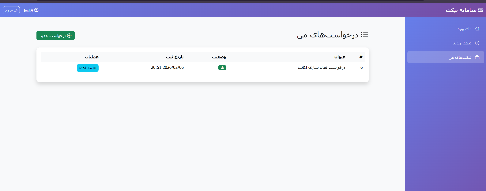
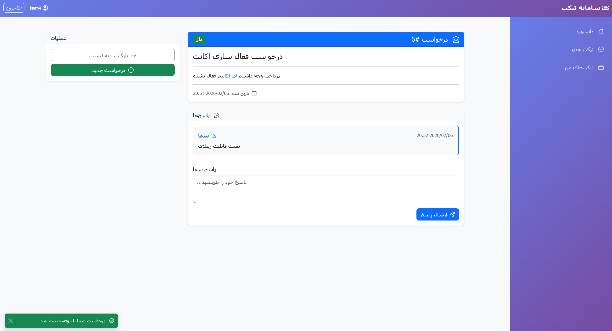
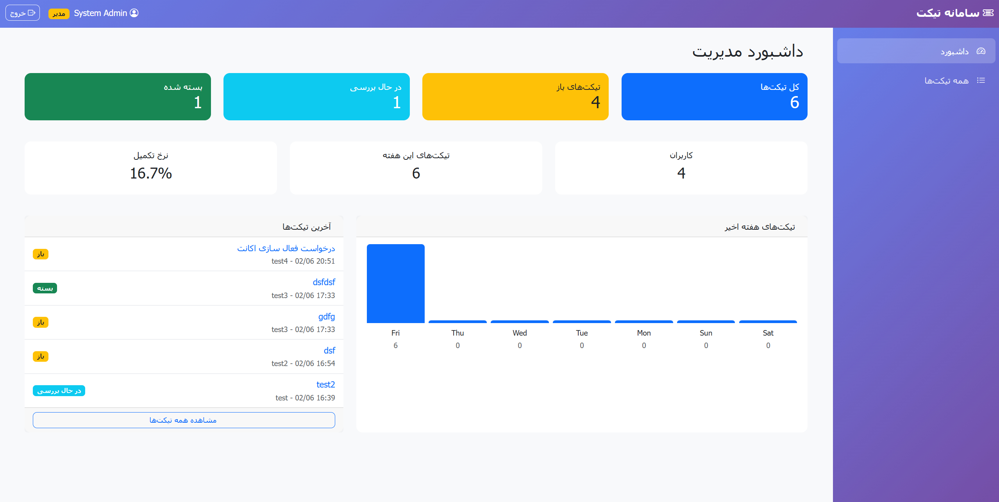
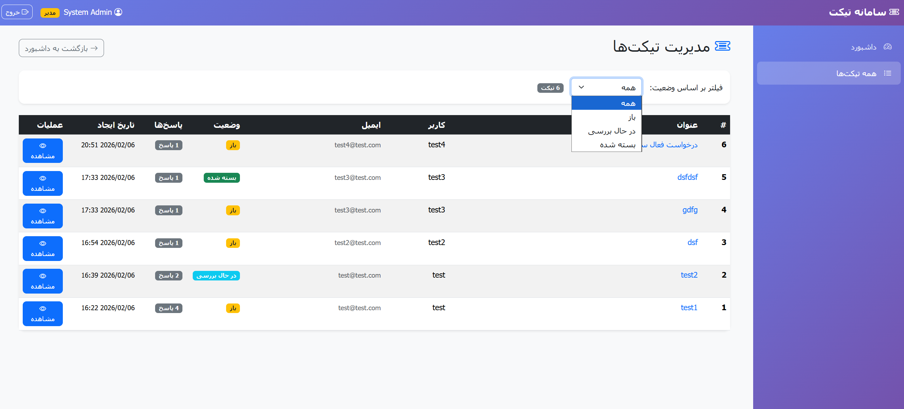
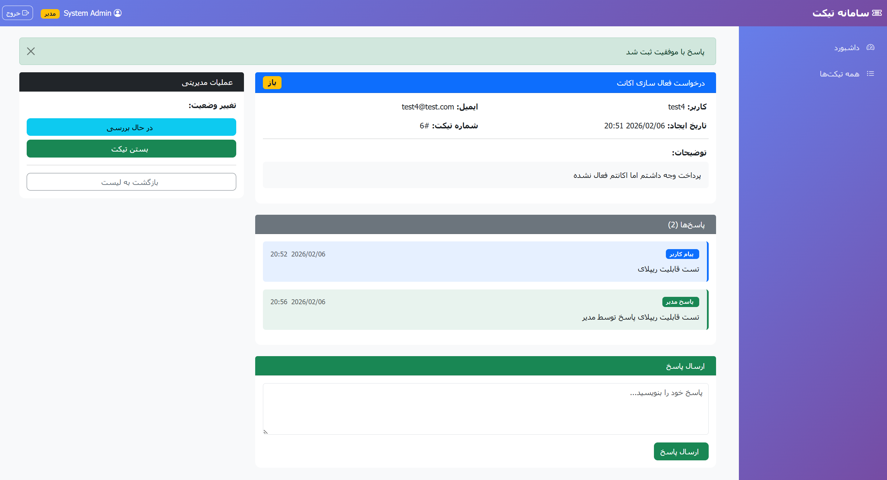
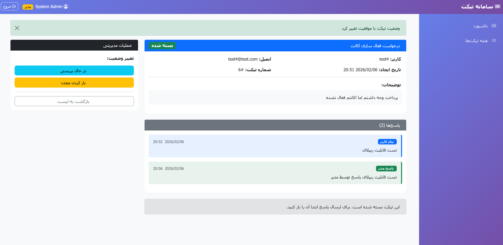

# Ticket Management System

A simple web-based ticket/request managment system built with ASP.NET Core MVC. This project allows users to submit and track their requests, while administrators can manage and respond to tickets.

## 📋 Project Overview

This system is a simplified version of real-world support systems (like IT support or student affairs). It demonstraits the core concepts of ASP.NET Core MVC including authentication, authorization, and CRUD operations.

## 🛠 Technologies Used

- ASP.NET Core MVC (.NET 8.0)
- Entity Framework Core
- SQLite Database
- Bootstrap 5

## 👥 User Roles

### Regular User
- Register and login to system
- Create new tickets/requests
- View their own tickets
- Track ticket status

### Administrator
- View all tickets in system
- Change ticket status (Open/InProgress/Closed)
- Reply to user tickets

## 📊 Database Structure

### User Entity
| Field | Type | Description |
|-------|------|-------------|
| Id | int | Primary key |
| FullName | string | User's full name |
| Email | string | User's email (unique) |
| PasswordHash | string | Hashed password |
| Role | string | User or Admin |

### Ticket Entity
| Field | Type | Description |
|-------|------|-------------|
| Id | int | Primary key |
| Title | string | Ticket title |
| Description | string | Ticket details |
| Status | string | Open/InProgress/Closed |
| CreatedAt | DateTime | Creation date |
| UserId | int | Foreign key to User |

### TicketReply Entity (Bonus Feature)
| Field | Type | Description |
|-------|------|-------------|
| Id | int | Primary key |
| TicketId | int | Foreign key to Ticket |
| Message | string | Reply content |
| CreatedAt | DateTime | Reply date |
| IsAdminReply | bool | True if admin replied |

## 🚀 How to Run

1. Make sure you have .NET 8.0 SDK installed
2. Clone the repository
3. Navigate to project folder:
```
cd src/TicketSystem
```
4. Run the application:

dotnet run
5. Open browser and go to `http://localhost:5000`

## 🔐 Default Admin Account

- **Email:** admin@ticket.com
- **Password:** admin123

## 📸 Screenshots

### User Account Screenshots











### Admin Account Screenshots









## 📁 Project Structure

```
TicketSystem/
├── Controllers/
│   ├── AccountController.cs
│   ├── AdminController.cs
│   ├── HomeController.cs
│   └── TicketController.cs
├── Models/
│   ├── User.cs
│   ├── Ticket.cs
│   └── TicketReply.cs
├── Views/
│   ├── Account/
│   ├── Admin/
│   ├── Home/
│   ├── Ticket/
│   └── Shared/
├── Data/
│   └── ApplicationDbContext.cs
├── ViewModels/
│   ├── AccountViewModels.cs
│   ├── AdminViewModels.cs
│   └── TicketViewModels.cs
├── wwwroot/
│   └── css/
└── Program.cs
```

## ⚙️ System Rules

- Each user can only see thier own tickets
- Only admin can change ticket status
- Default status for new tickets is "Open"
- Admin can reply to tickets and change status

## 🔧 Deployment Notes

The project can be deployed to:
- IIS (Internet Information Services)
- Azure App Service
- Any server supporting .NET 8.0

For detailed deployment instrucions, see the Deployment Guide document.

## 📄 Database Migration

To create database from scratch:

dotnet ef migrations add InitialCreate
dotnet ef database update

Or use the provided SQL script in `Database_Script.sql`

## ✨ Features Implemented

- [x] User registration and login
- [x] Password hashing with BCrypt
- [x] Session-based authentication
- [x] Create new tickets
- [x] View ticket list
- [x] View ticket details
- [x] Admin dashboard
- [x] Change ticket status
- [x] Reply to tickets (Bonus)
- [x] Persian-style UI theme

## 👨‍💻 Developer Notes

This project was developed as a university assignment. It covers all the requirments specified in the project document including:

1. Complete source code ✅
2. Database migration/script ✅
3. Screenshots of running application ✅
4. Deployment documentation ✅
